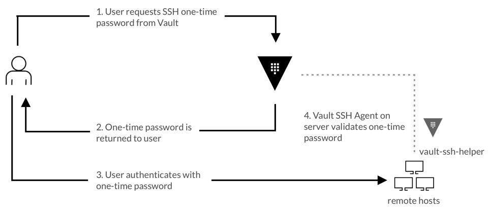

<!-- $theme: gaia -->

# Landslide

---

## Use Vault manage static secrets


### Persionas

The end-to-end scenario described in this guide involves two personas:

**devops** with privileged permissions to write secrets
**apps** reads the secrets from Vault

---

### Steps

#### 1. Run the Vault server

```bash
docker run -d --name vault-demo --rm -p 8200:8200 vault
```

#### 2. Get Vault Token and Unseal Key

```
docker logs vault-demo

export VAULT_ADDR='http://127.0.0.1:8200'
export VAULT_TOKEN="s.KKYLixXUcwjGjxcpZh2hybus"

vault status
docker exec -e VAULT_ADDR='http://0.0.0.0:8200' vault-demo vault status
```

---

#### 3. Create sample policy

```
cat > policy.hcl <<EOF
# To view in Web UI
path "sys/mounts" {
  capabilities = [ "read", "update" ]
}
# To configure the SSH secrets engine
path "ssh/*" {
  capabilities = [ "create", "read", "update", "delete", "list" ]
}
# To enable secret engines
path "sys/mounts/*" {
  capabilities = [ "create", "read", "update", "delete" ]
}
EOF

vault policy write ssh_manager policy.hcl

```

---

#### 4. Enable userpass login method

```
# Enable userpass login method
vault auth enable userpass

# Create user
vault write auth/userpass/users/binhoul \
password=password \
policies=ssh_manager

#User login
unset VAULT_TOKEN
vault login -method userpass \
    username=binhoul \
    password=password

```

---

#### 5. Create a role for otp engine 

```
vault write ssh/roles/otp_demo \
key_type=otp \
default_user=ubuntu \
cidr_list=0.0.0.0/0

```

#### 6. Generate OTP

```
vault write ssh/creds/otp_demo ip=x.x.x.x
```

---

## What's the problem?

- Immutable infrastructure is still future state for some enterprises
- SSH key sprawl
- Little or no accounting of user access
- Access management is tedious

---

## Vault and SSH

- Unique SSH credentials on demand
  - One-Time-Passwords
  - Signing authority for SSH keys
- Time-to-live on SSH credentials
- Audit logging for SSH access


---

## SSH OTP

---



- An authenticated client requests an OTP from the Vault server. 
- Vault issues and returns an OTP. 
- Connect to the desired target host using OTP.

---


- When the client establishes an SSH connection, the OTP is received by the Vault helper which validates the OTP with the Vault server.

- The Vault server then deletes this OTP, ensuring that it is only used once.

---


